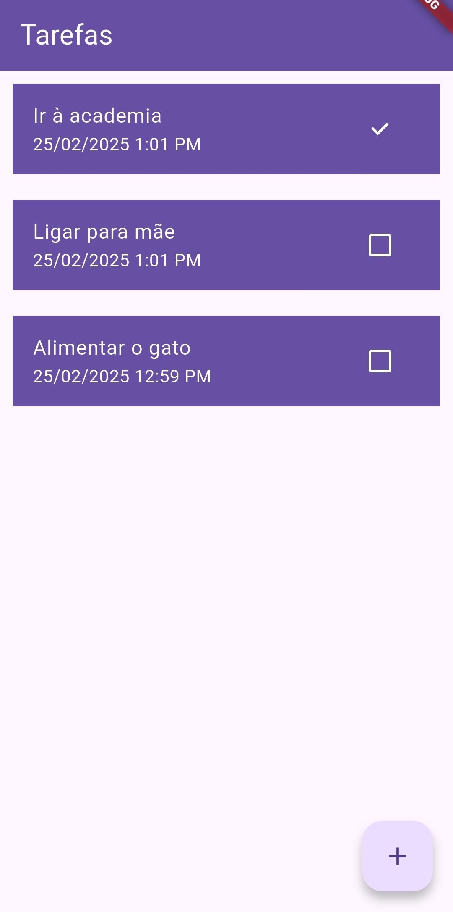
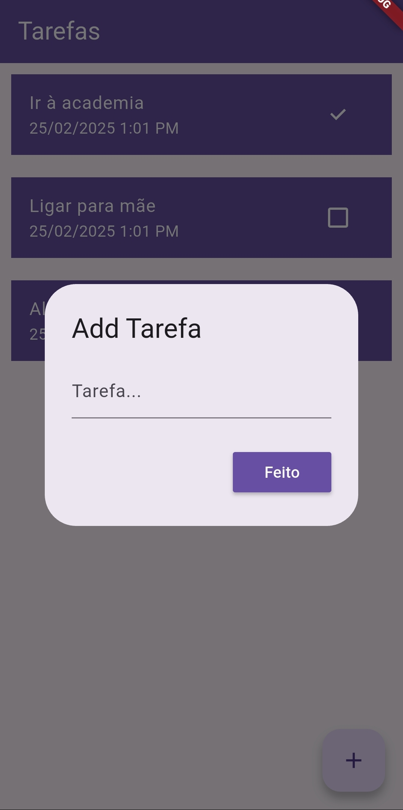

# Teste Firestore
 Um app simples com Flutter para explorar e testar as funcionalidades básicas do Firestore

## Funcionalidades
- Persistência de dados com banco nosql;
- Adicionar tarefas;
- Remover tarefas;
- Alterar tarefas.

## Screenshots

<p align="center">
  
  
</p>

## Testando o App
Para rodar o aplicativo, crie um projeto no firebase. Você pode seguir as instruções em <a href="https://console.firebase.google.com/">https://console.firebase.google.com</a>.

1. Instale o flutterfire CLI:

    ```
    dart pub global activate flutterfire_cli 
    ```
2. Configure o projeto criado no firebase para trabalhar em conjunto a aplicação:

    ```
    flutterfire configure
    ```
    Ao término dessa operação, um arquivo “firebase_options.dart” deve ter sido criado na pasta lib do projeto Flutter.
3. Instale as dependências:

    ```
    flutter pub get
    ```
4. Rode em um emulador ou celular conectado à internet.